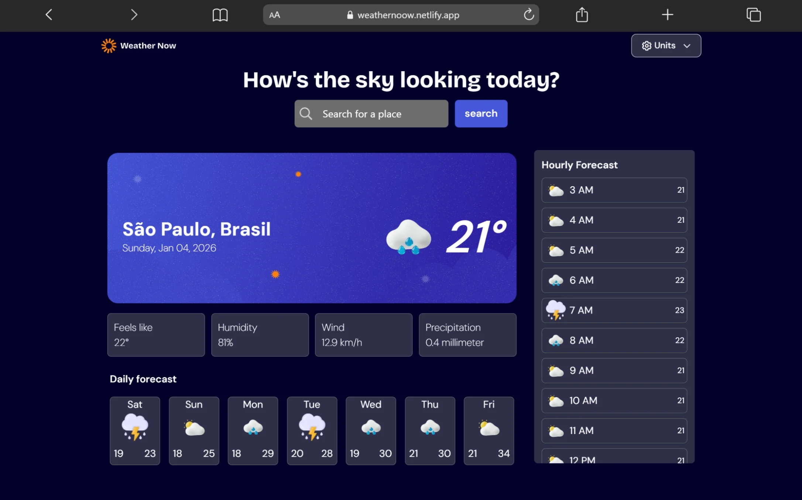
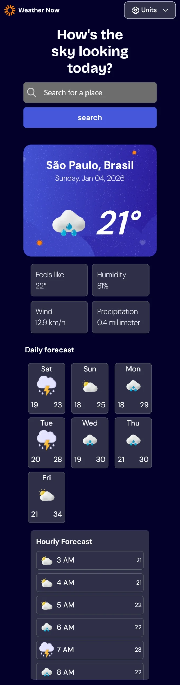

# Weather App 🌦️

A weather forecast application built to practice modern React concepts, API consumption, and asynchronous state management.

🔗 **Live Demo:** [weathernoow.netlify.app](https://weathernoow.netlify.app)

<div align="center">

</div>
<div align="center">

</div>

## 🚀 Technologies

-   **Core:** React, TypeScript, Vite
-   **Styling:** Tailwind CSS
-   **State/Data Management:** TanStack Query (React Query)
-   **HTTP Client:** Axios
-   **APIs:**
    -   [Open-Meteo](https://open-meteo.com/) (Weather data)
    -   [Nominatim / OpenStreetMap](https://nominatim.org/) (Geocoding and City Search)

## ✨ Features

-   📍 **Geolocation:** Automatically detects the user's location upon opening.
-   🔍 **Search:** Search for cities and states globally.
-   📅 **Forecast:**
    -   Current conditions (Temperature, Wind, Humidity, etc.).
    -   Hourly forecast.
    -   Weekly forecast.
-   🎨 **UI:** Responsive interface with dynamic weather icons based on conditions.

## 📦 How to run

1.  **Clone the repository:**

    ```bash
    git clone [https://github.com/Caue-Ribeiro/Weather-App.git](https://github.com/Caue-Ribeiro/Weather-App.git)
    cd Weather-App
    ```

2.  **Install dependencies:**

    ```bash
    npm install
    ```

3.  **Run the project:**
    ```bash
    npm run dev
    ```

---

Developed by [Cauê Ribeiro](https://github.com/Caue-Ribeiro) for study purposes.
